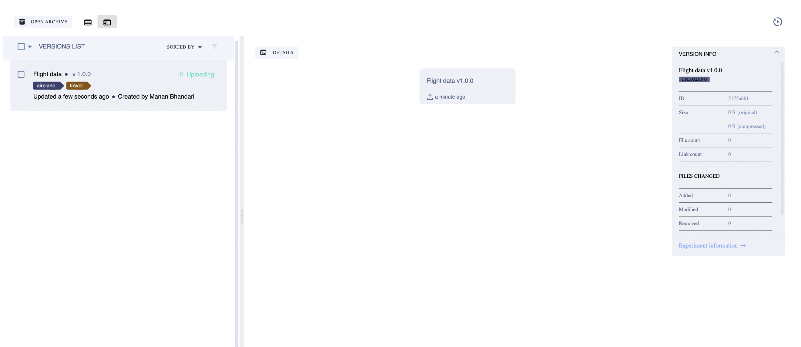
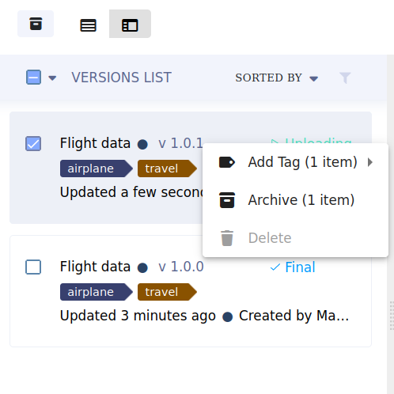

# User Guide
Code Snippets are available in notebooks for all the code blocks mentioned below. Snippets can be easily dragged-and-dropped for usage.
## Datasets
TODO: Define dataset here
### Creating datasets
A dataset can be created: 
 1. From scratch:  
    ```python
    dataset = Dataset.create(
		dataset_name='Flight data', # name of dataset
	    dataset_version = '1.0.0', # Optional str
	    dataset_tags = ['travel', 'airplane'],  # Optional list of str
    )  
    ```
    
   
 2. By using another dataset as a base:
		Specify the parent datasets under **parent_datasets**
	```python
	dataset = Dataset.create(
		dataset_name='Flight data', # name of dataset
		dataset_version = '1.0.1', # type: Optional str
		dataset_tags = ['travel', 'airplane'],  # type: Optional list of str
		parent_datasets = ["c6b147a022274092bc3e1b75f5f09d7a"] # specify the ID of the parent dataset
	)
	```
    

 3. Combining multiple datasets:
	```python
	Dataset.squash(dataset_name="Flight data", dataset_ids=["87033f7004164dd0aa7106d419e3aa1a", "c6b147a022274092bc3e1b75f5f09d7a"])
	```

### Add files
Files can be added to a dataset:
 1.  By uploading local files:
	  **path** refers to the relative path of the files/folder
	  **wildcard** can be used to select specific file, ex. wildcard="*.png" to select all .png files
	  **dataset_path** is the path within the dataset where we want the files to be uploaded
		```python
	 dataset.add_files(path='paths.csv', wildcard=None, dataset_path=None) # local path of files to be uploaded 
	 dataset.upload()
	 ```
     

2. By uploading S3 files:
	**source_url** for S3 files is in the format: s3://bucket-name/file-path
	```python
	 dataset.add_external_files(source_url="", wildcard=None, dataset_path=None) # upload files from s3
	dataset.upload()
	 ```
3. Uploading S3 files from the non-default S3 account:
	**source_url** for S3 files is in the format: s3://bucket-name/file-path
	**aws_access_key**, **aws_secret_key**, & **region** are the AWS credentials required to access the S3 files of the account.
	```python
	dataset.add_external_files(source_url="",
                          wildcard=None, 
                          dataset_path=None
                          aws_access_key="",
                          aws_secret_key="",
                          region="")
	dataset.upload()
	```
### Download a dataset
To download a dataset, use:
```python
dataset = Dataset.get(dataset_id="c6b147a022274092bc3e1b75f5f09d7a") # get ID from GUI
dataset_files_path = dataset.useDataset() # dataset_files_path is the local path of the downloaded dataset.
```
### Archive a dataset
Datasets can be archived from the UI, where they can be then viewed under the archived section & can be restored

### Delete a dataset
To delete:
```python
Dataset.delete(dataset_id="c6b147a022274092bc3e1b75f5f09d7a") # get ID from GUI
```
### Publish a dataset
Publishing a dataset means making it non-editable
```python
dataset = Dataset.get(dataset_id="c6b147a022274092bc3e1b75f5f09d7a") # get ID from GUI
dataset.publish()
```

## Experiments
An experiment refers to a code execution session. 
An experiment captures the following:
1. Python environment
2. Run information
3. Console output
4. Hyperparameters
5. Artifacts
6. Plots (recorded automatically)

### Create an experiment
```python
experiment = Experiment.init(
    experiment_name='Linear Regression', # experiment name of at least 3 characters
    tags=['Regression','Best fit'], # Add a list of tags (str) to the created Experiment
)
```


### Get an existing experiment
```python
experiment = Experiment.get_experiment(experiment_id='c6b147a022274092bc3e1b75f5f09d7a') # get experiment ID from GUI
```


### Monitor an experiment's progress
```python
experiment = Experiment.get_experiment(experiment_id='c6b147a022274092bc3e1b75f5f09d7a') # get experiment ID from GUI
experiment.set_progress(0)
# experiment doing stuff
experiment.set_progress(50)
print(experiment.get_progress())
```
An experiment's progress can be seen in the experiments list panel as a loader & in the INFO tab. In the image below, the progress is 50%.


### Hyperparameters
Hyperparameters are a script's configuration. Many command line parameters are automatically logged by CaiML including:
- click
- argparse 
- Python Fire 
- LightningCLI

TensorFlow Definitions are also automatically logged: TensorFlow MNIST & TensorBoard PR Curve

Here's an example of automatic logging of tensorflow hyperparameters


To manually log hyperparameters:
#### Manually log hyperparameters
```python
experiment = Experiment.get_experiment(experiment_id='c6b147a022274092bc3e1b75f5f09d7a') # get experiment ID from GUI
experiment.set_parameters_as_dict({'epochs': 20, 'max_value':100}) # pass hyperparameters as string:number dictionary
```

#### Log python objects
Python objects such as variables, classes, numpy objects can be logged
```python 
experiment = Experiment.get_experiment(experiment_id='c6b147a022274092bc3e1b75f5f09d7a') # get experiment ID from GUI
params_dict = {'epochs': 20, 'max_value':100}
experiment.connect(params_dict)
```
### Artifacts
CaiML allows easy storage of experiments' output products as artifacts that can later be accessed easily and used. Some examples of artifacts are:
-   Numpy objects
-   Pandas DataFrames
-   PIL
-   Files and folders
-   Python objects


#### Upload python objects as artifacts

Python objects can be uploaded as artifacts:
```python
experiment = Experiment.get_experiment(experiment_id='c6b147a022274092bc3e1b75f5f09d7a') # get experiment ID from GUI
params_dict = {'epochs': 20, 'max_value':100}
experiment.upload_artifact(name='Parameters dictionary', artifact_object=params_dict)
```
#### Upload files as objects
To upload files/folders as artifacts:
**artifact_object** refers to the relative path of the file/folder
```python
experiment = Experiment.get_experiment(experiment_id='c6b147a022274092bc3e1b75f5f09d7a') # get experiment ID from GUI
experiment.upload_artifact(name='Sunflower image', artifact_object='images/sunflower.jpg')
```

### Finalise an experiment
To make an experiment non-editable:
```python
experiment = Experiment.get_experiment(experiment_id='') # get experiment ID from GUI
experiment.close()
```

## Models
CaiML provides automatic recording of standard python models such as:
- Tensorflow
- Keras
- Pytorch
- scikit-learn (only using joblib)
- XGBoost (only using joblib)
- FastAI
- MegEngine
- CatBoost

To record a model, simply initiate  a CaiML experiment in your notebook code:
```python
experiment = Experiment.init(
    experiment_name='Tensorflow Model', # experiment name of at least 3 characters
)
```


To manually log a model:

### Manually log a model
```python
experiment = Experiment.init(experiment_name="Model experiment")
output_model = OutputModel(experiment=experiment, 
                            name="Sample model", # Optional
                            framework=None, # Optional, framework to be used like PyTorch
                            config_dict=None, # Optional, configuration as a dictionary
                            label_enumeration=None, # Optional, add labels to your model as a dictionary
                            tags=None) # Optional, add tags to your model as list of strings 

# For the model to be recorded, add a weights file
output_model.update_weights(weights_filename='', # Either add a local weights file here
                            registered_uri='https://github.com/ultralytics/yolov5/releases/download/v6.2/yolov5x6.pt') # or add a valid URL of the weights file here
```

### Use a registered model
Use a model registered with CaiML
```python
from caiml import InputModel
input_model = InputModel(model_id="c6b147a022274092bc3e1b75f5f09d7a") # get model_id from the GUI
```

### Use an external model
```python
from caiml import InputModel
input_model = InputModel.import_model(weights_url="https://github.com/ultralytics/yolov5/releases/download/v6.2/yolov5x6.pt", # A valid URL for the weights file. For a local file user file://
                            name="Sample Model", # Optional
                            framework=None, # Optional, framework to be used like PyTorch
                            config_dict=None, # Optional, configuration as a dictionary
                            label_enumeration=None, # Optional, add labels to your model as a dictionary
                            tags=None) # Optional, add tags to your model as list of strings
```

### Update a model
A model's weight file can be updated
```python
from caiml import OutputModel
output_model.update_weights(weights_filename='', # Either add a local weights file here
                            registered_uri='https://github.com/ultralytics/yolov5/releases/download/v6.2/yolov5x6.pt') # or add a valid URL of the weights file here
```

### Add metadata to model
```python
from caiml import InputModel, OutputModel
model.set_metadata("epochs", 20) # model can be an instance of either of OutputModel/InputModel class
```

### Finalize a model
Make a model non-editable
```python
from caiml import InputModel, OutputModel
model.publish() 
```

### Get Model URL
Similarly other properties can be gotten from a model. An exhaustive list can be found in the code snippets in notebook.
```python
from caiml import InputModel, OutputModel
url = model.url # model can be an instance of either of OutputModel/InputModel class
```